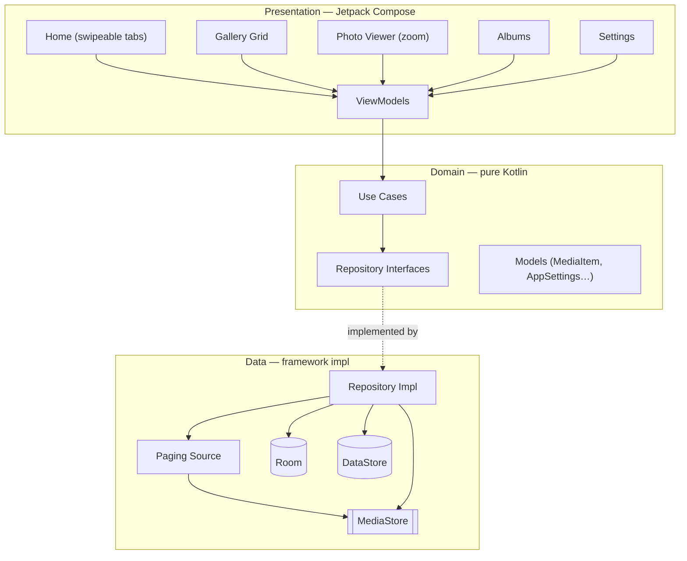

<div align="center">

# AGallery

**A modern, offline-first photo & video gallery for Android — built entirely with Jetpack Compose and a liquid-glass UI.**

[](https://kotlinlang.org/)
[-3DDC84?style=for-the-badge&logo=android&logoColor=white)](https://developer.android.com/)
[](https://developer.android.com/jetpack/compose)
[](https://m3.material.io/)
[](https://gradle.org/)
[](https://insert-koin.io/)
[](https://coil-kt.github.io/coil/)
[](./LICENSE)
[](../../releases)

</div>

AGallery is a clean, fast gallery app that reads photos and videos straight from
the device's `MediaStore` — no accounts, no cloud, no tracking. It pages through
thousands of items smoothly, renders a frosted **liquid-glass** navigation bar,
and ships a full-screen viewer with pinch-to-zoom. The codebase follows a
**clean-architecture, feature-first** structure with Koin dependency injection
and is written 100% in Jetpack Compose.

> **Status:** early preview (`0.1.0`). Core browsing, viewing, video thumbnails,
> sorting, settings, and single-item delete are working. Album browsing is a
> placeholder and is the next milestone.

---

## Table of Contents

- [Overview](#overview)
- [Features](#features)
- [Tech Stack](#tech-stack)
  - [App & UI](#app--ui)
  - [Architecture & DI](#architecture--di)
  - [Media & Data](#media--data)
  - [Design & Icons](#design--icons)
- [Architecture](#architecture)
- [Project Structure](#project-structure)
- [Getting Started](#getting-started)
  - [Prerequisites](#prerequisites)
  - [Clone & Open](#clone--open)
  - [Build a Debug APK](#build-a-debug-apk)
- [Release Builds & Signing](#release-builds--signing)
  - [1. Generate a keystore](#1-generate-a-keystore)
  - [2. Add GitHub Actions secrets](#2-add-github-actions-secrets)
  - [3. Sign locally (optional)](#3-sign-locally-optional)
  - [4. Cut a release](#4-cut-a-release)
- [Versioning](#versioning)
- [Usage](#usage)
- [License](#license)

---

## Overview

Most stock galleries are heavy, ad-laden, or tied to a cloud account. AGallery
is the opposite: a lightweight, **offline-first** viewer that treats the device
itself as the single source of truth. It queries `MediaStore` through a paged
data source so even libraries with tens of thousands of items scroll without
jank, caches lightweight metadata in Room, and persists user preferences (grid
density, sort order, edge-effect style) in a typed DataStore.

The UI is deliberately expressive. The bottom navigation is a **floating
liquid-glass bar** (real-time refraction via the Kyant `backdrop` library on
Android 13+, with a frosted fallback below that), photos open into a shared-
element full-screen viewer, and long-pressing a thumbnail "peeks" the image at
its **original aspect ratio** over a blurred backdrop with a glass context menu.

Everything is structured around **clean architecture**: `presentation` →
`domain` → `data`, with UI-agnostic use cases in the middle and Koin wiring the
layers together. Media access, deletion (scoped-storage aware), and preferences
all live behind repository interfaces, so the Compose layer never talks to the
Android framework directly.

## Features

| Feature | Description |
|---|---|
| **Offline-first gallery** | Reads images & videos directly from `MediaStore` — no network, accounts, or cloud. |
| **Buttery paging** | A paged `MediaStore` source (Jetpack Paging 3) streams thousands of items with a tuned, high-sensitivity fling. |
| **Liquid-glass navigation** | A floating bottom bar with real refraction (Kyant `backdrop`, API 33+) and an automatic frosted fallback on older devices. |
| **Swipeable tabs** | Gallery ↔ Albums switch via a `HorizontalPager` and a glass pill segmented control kept in sync. |
| **Full-screen viewer** | Shared-element transition into a pinch-to-zoom viewer (Telephoto) with a theme-aware background. |
| **iOS-style pull-to-refresh** | The grid drags first, then reveals a centered indicator in the gap. |
| **Video support** | Video thumbnails are decoded via Coil, badged with a play icon and formatted duration. |
| **Long-press peek** | Hold a photo to grow it to its **original aspect ratio** over a blurred backdrop, with a liquid-glass context menu. |
| **Scoped-storage delete** | Deletes go through the platform `createDeleteRequest` consent flow (Android 11+), then auto-refresh the grid. |
| **Persistent preferences** | Grid columns (3–5), sort order, and edge-effect style survive app restarts via a typed DataStore. |
| **Splash & edge-to-edge** | Uses the AndroidX splash screen and draws edge-to-edge behind the system bars. |

## Tech Stack

### App & UI

- **Kotlin 2.4** targeting **Android 8.0+ (minSdk 29)**, compiled against **SDK 37** with **AGP 9.2**.
- **Jetpack Compose** (BOM `2026.06.01`) — 100% Compose UI, no XML layouts.
- **Material 3 `1.5.0-alpha` (Expressive)** — pinned explicitly for `ButtonGroup` / `ToggleButton` APIs not yet in the BOM-managed stable.
- **Navigation 3** (`navigation3-runtime` / `-ui`) with ViewModel scoping for Nav3.
- **AndroidX Splash Screen** + edge-to-edge.

### Architecture & DI

- **Clean architecture** — `presentation` → `domain` → `data`, feature-first modules.
- **Koin 4.2** (BOM) — dependency injection across repositories, use cases, and ViewModels.
- **Kotlinx Coroutines / Flow** — reactive state throughout.
- **Lifecycle ViewModel + Compose** — screen state holders.

### Media & Data

- **`MediaStore`** — the single source of truth for photos & videos.
- **Jetpack Paging 3** (`runtime` + `compose`) — paged media loading.
- **Room 2.8** — local cache for lightweight metadata (albums, favorites).
- **DataStore 1.2** (typed / `kotlinx.serialization`) — persisted user settings.
- **Accompanist Permissions** — runtime media-permission handling (partial-access aware on Android 14+).

### Design & Icons

- **Coil 3.5** (`coil-compose` + `coil-video`) — image & video-frame loading and caching.
- **Telephoto 0.19** — pinch-to-zoom in the full-screen viewer.
- **Kyant `backdrop` 2.0 + `shapes` 1.2** — the liquid-glass refraction effect.
- **Phosphor Icons** — the app's icon set (Material Icons are intentionally **not** used).
- **kotlinx.serialization** — DataStore models & navigation keys.

## Architecture

AGallery is organized into three layers per feature. The Compose screens in
`presentation` observe ViewModels; ViewModels invoke framework-agnostic **use
cases** in `domain`; use cases talk to **repository interfaces** whose
implementations live in `data` and wrap `MediaStore`, Room, and DataStore. Koin
binds each layer together, so nothing in `presentation` or `domain` depends on
the Android framework directly.



## Project Structure

```text
AGallery/
├─ app/
│  └─ src/main/
│     ├─ AndroidManifest.xml           # Media permissions (READ_MEDIA_*, partial access)
│     ├─ res/                          # Icons, themes, splash, backup rules
│     └─ java/id/andreasmbngaol/agallery/
│        ├─ AGalleryApp.kt             # Application class (starts Koin)
│        ├─ MainActivity.kt            # Single activity, edge-to-edge + splash
│        ├─ core/                      # Cross-cutting
│        │  ├─ common/                 #   shared helpers
│        │  ├─ di/                     #   root Koin modules
│        │  ├─ navigation/             #   nav keys / display
│        │  ├─ permission/             #   media permission gate
│        │  └─ ui/                     #   GalleryTabScaffold (liquid glass), EdgeEffectDefaults
│        ├─ data/                      # Data layer
│        │  ├─ di/                     #   DataStore + repository bindings
│        │  ├─ local/mediastore/       #   MediaStoreDataSource (query + delete request)
│        │  ├─ local/prefs/            #   DataStore settings
│        │  ├─ local/room/             #   Room dao + entities
│        │  ├─ mapper/                 #   DTO ↔ domain mappers
│        │  ├─ paging/                 #   MediaPagingSource
│        │  └─ repository/             #   Repository implementations
│        ├─ domain/                    # Domain layer (pure Kotlin)
│        │  ├─ di/                     #   use-case factories
│        │  ├─ model/                  #   MediaItem, AppSettings, GallerySortOrder…
│        │  ├─ repository/             #   repository interfaces
│        │  └─ usecase/                #   GetMediaPaging, DeleteMedia, SetGridColumns…
│        └─ presentation/              # Presentation layer
│           ├─ animation/              #   shared-element helpers
│           ├─ home/                   #   HomeTabsScreen (pager + tabs)
│           ├─ gallery/                #   GalleryGridScreen + ViewModel
│           ├─ viewer/                 #   PhotoViewerScreen + ViewModel
│           ├─ albums/                 #   AlbumsScreen (WIP)
│           ├─ settings/               #   SettingsScreen + ViewModel
│           └─ theme/                  #   Material 3 theme
├─ .github/workflows/release.yml       # CI: build & publish a signed release APK on tag
├─ gradle/libs.versions.toml           # Version catalog
├─ build.gradle.kts                    # Root build
├─ settings.gradle.kts                 # includes :app
├─ keystore.properties.example         # Template for local release signing (copy to keystore.properties)
└─ README.md
```

## Getting Started

### Prerequisites

- **[Android Studio](https://developer.android.com/studio)** (latest canary/preview — the project uses **AGP 9.2** and **compileSdk 37**).
- **JDK 17+** (bundled with recent Android Studio).
- An Android device or emulator running **Android 8.0 (API 29) or newer**.

### Clone & Open

```shell
git clone https://github.com/andreasmbngaol/AGallery.git
cd AGallery
```

Open the folder in Android Studio and let Gradle sync. `local.properties`
(pointing at your SDK) is generated automatically and is **not** committed.

### Build a Debug APK

```shell
./gradlew :app:assembleDebug
# → app/build/outputs/apk/debug/app-debug.apk
```

Or just press **Run** in Android Studio to install on a connected device.

## Release Builds & Signing

Release APKs are built and published automatically by **GitHub Actions**
(`.github/workflows/release.yml`) whenever you push a `v*` tag. The workflow
decodes a keystore from repository secrets, builds `:app:assembleRelease`, and
attaches the signed APK to a GitHub Release. Signing is wired in
`app/build.gradle.kts` and reads credentials from **either** a local
`keystore.properties` file **or** environment variables (used in CI) — if
neither is present, a release build falls back to debug signing so local builds
never break.

### 1. Generate a keystore

A ready-to-use keystore has been generated for this repo (see the credentials
shared with you). To create your own instead:

```shell
keytool -genkeypair -v \
  -keystore release.keystore \
  -alias agallery \
  -keyalg RSA -keysize 2048 -validity 10000 \
  -storepass "YOUR_STORE_PASSWORD" \
  -keypass  "YOUR_KEY_PASSWORD" \
  -dname "CN=Your Name, O=AGallery, C=ID"
```

> ⚠️ **Never commit the keystore or its passwords.** `*.keystore` and
> `keystore.properties` are already git-ignored. Keep a safe backup — losing the
> keystore means you can no longer ship updates under the same signature.

### 2. Add GitHub Actions secrets

In your repository go to **Settings → Secrets and variables → Actions → New
repository secret** and add these four secrets:

| Secret name | Value |
|---|---|
| `KEYSTORE_BASE64` | The keystore file, base64-encoded (`base64 -w0 release.keystore`). |
| `KEYSTORE_PASSWORD` | The store password. |
| `KEY_ALIAS` | The key alias (e.g. `agallery`). |
| `KEY_PASSWORD` | The key password. |

The workflow decodes `KEYSTORE_BASE64` back into `release.keystore` at build
time and passes the other three to Gradle as environment variables.

### 3. Sign locally (optional)

To produce a signed release APK on your own machine, copy the template and fill
it in (this file is git-ignored):

```shell
cp keystore.properties.example keystore.properties
```

```properties
storeFile=release.keystore
storePassword=YOUR_STORE_PASSWORD
keyAlias=agallery
keyPassword=YOUR_KEY_PASSWORD
```

```shell
./gradlew :app:assembleRelease
# → app/build/outputs/apk/release/app-release.apk
```

### 4. Cut a release

Bump the version (see below), commit, then tag and push:

```shell
git tag v0.1.0
git push origin v0.1.0
```

The workflow runs, builds the signed APK, and creates a **GitHub Release**
tagged `v0.1.0` with the APK attached and auto-generated release notes. You can
also trigger it manually from the **Actions** tab (`workflow_dispatch`).

## Versioning

AGallery follows **[Semantic Versioning](https://semver.org/)** (`MAJOR.MINOR.PATCH`).

- The current version is **`0.1.0`** — the first tagged, installable preview.
- It is **`0.x`** on purpose: the public surface is still evolving and Albums is
  incomplete, so anything below `1.0.0` may change without notice.
- `MINOR` bumps (`0.2.0`, `0.3.0`…) add features (e.g. real album browsing);
  `PATCH` bumps (`0.1.1`…) are bug fixes.
- `1.0.0` will mark the first feature-complete, stable release.

The version lives in `app/build.gradle.kts`:

```kotlin
versionCode = 1        // bump by 1 for every published build
versionName = "0.1.0"  // human-readable, matches the git tag (without the leading "v")
```

## Usage

1. **Grant media access** on first launch (Android 14+ lets you share only
   selected photos — the app handles partial access).
2. **Browse** the grid; pull down to refresh, and change grid density or sort
   order from **Settings** (both persist across restarts).
3. **Swipe** between **Gallery** and **Albums**, or tap the glass pill in the
   floating bar.
4. **Tap** a photo to open the full-screen viewer and **pinch to zoom**.
5. **Long-press** a thumbnail to peek it at its original aspect ratio over a
   blurred backdrop; use the glass menu to **Delete** (the system confirms the
   deletion on Android 11+).

## License

This project is licensed under the **MIT License** — see the [LICENSE](./LICENSE)
file for details. You are welcome to use, study, and build upon it, provided the
original copyright and attribution are preserved.

© 2026 Andreas Manatar Lumban Gaol
