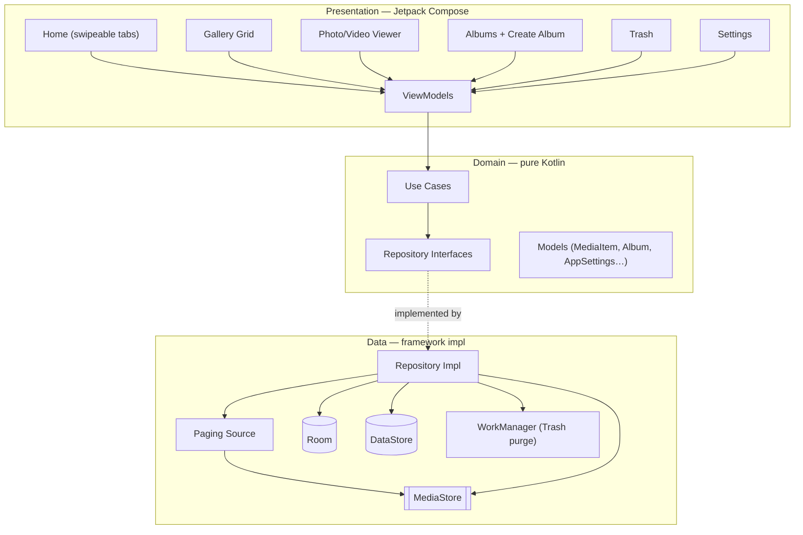

# Architecture

AGallery is organized into three layers per feature. The Compose screens in
`presentation` observe ViewModels; ViewModels invoke framework-agnostic **use
cases** in `domain`; use cases talk to **repository interfaces** whose
implementations live in `data` and wrap `MediaStore`, Room, and DataStore. Koin
binds each layer together, so nothing in `presentation` or `domain` depends on
the Android framework directly.



## Layer responsibilities

- **Presentation** — Compose screens and ViewModels. Holds UI state, collects
  flows, and delegates every action to a use case. Never touches the Android
  media framework directly.
- **Domain** — pure Kotlin. Use cases encode a single piece of business logic
  (e.g. `MoveMediaToAlbumUseCase`, `ToggleFavoriteUseCase`) and depend only on
  repository interfaces and models.
- **Data** — the only layer that knows about `MediaStore`, Room, DataStore, and
  WorkManager. Repository implementations translate framework types into domain
  models via mappers.

## Project structure

```text
a-gallery/
├─ app/
│  └─ src/main/
│     ├─ AndroidManifest.xml           # Media permissions (READ_MEDIA_*, partial access)
│     ├─ res/                          # Icons, themes, splash, backup rules
│     └─ java/id/andreasmbngaol/agallery/
│        ├─ AGalleryApp.kt             # Application class (starts Koin + WorkManager)
│        ├─ MainActivity.kt            # Single activity, edge-to-edge + splash
│        ├─ core/                      # Cross-cutting
│        │  ├─ common/                 #   shared helpers
│        │  ├─ di/                     #   root Koin modules
│        │  ├─ navigation/             #   nav keys / display (Navigation 3)
│        │  ├─ permission/             #   media permission gate
│        │  ├─ ui/                     #   GalleryTabScaffold (liquid glass), style defaults
│        │  └─ ai/                     #   ONNX inference engine, device benchmark, tensor utils
│        ├─ data/                      # Data layer
│        │  ├─ di/                     #   DataStore + repository bindings
│        │  ├─ local/mediastore/       #   MediaStoreDataSource (query + delete/move requests)
│        │  ├─ local/prefs/            #   DataStore settings
│        │  ├─ local/room/             #   Room dao + entities
│        │  ├─ mapper/                 #   DTO ↔ domain mappers
│        │  ├─ paging/                 #   MediaPagingSource
│        │  ├─ repository/             #   Repository implementations
│        │  └─ ai/                     #   AI model repo + background-removal processor
│        ├─ domain/                    # Domain layer (pure Kotlin)
│        │  ├─ di/                     #   use-case factories
│        │  ├─ model/                  #   MediaItem, Album, AppSettings… + ai/ (ModelCatalog, specs)
│        │  ├─ repository/             #   repository interfaces (+ AiModelRepository)
│        │  └─ usecase/                #   GetMediaPaging, MoveMediaToAlbum… + ai/ (RemoveBackground…)
│        └─ presentation/              # Presentation layer
│           ├─ animation/              #   shared-element helpers
│           ├─ home/                   #   HomeTabsScreen (pager + tabs)
│           ├─ gallery/                #   GalleryGridScreen + ViewModel
│           ├─ viewer/                 #   PhotoViewerScreen, VideoPlayer, AlbumThumbnailPicker
│           ├─ albums/                 #   AlbumsScreen, AlbumDetail, CreateAlbum
│           ├─ trash/                  #   TrashScreen + ViewModel
│           ├─ settings/               #   SettingsScreen + ViewModel
│           ├─ tools/                  #   Tools hub + QR generator
│           ├─ ai/                     #   AI models screen, import UX, Background Remover, Image Upscaler
│           └─ theme/                  #   Material 3 theme
├─ .github/workflows/release.yml       # CI: build & publish a signed release APK on tag
├─ gradle/libs.versions.toml           # Version catalog
├─ docs/                               # This documentation site
├─ THIRD-PARTY-NOTICES.md              # Open-source attributions
├─ LICENSE                             # PolyForm Noncommercial 1.0.0
└─ README.md                           # User-facing overview
```

## Key domain concepts

- **`MediaScope`** — describes what a screen/album shows: `Camera`, `AllMedia`,
  `AllVideos`, `Screenshots`, `ScreenRecordings`, `Favorites`, `Trash`, or a
  specific `Bucket(bucketId)` (a real device folder).
- **Smart vs. folder albums** — smart albums (Recent, Videos, Favorites, etc.)
  are computed views over `MediaStore`; folder albums map to on-disk buckets.
- **Special albums** — Recent, Videos, and Favorites only expose *Delete* in
  multi-select; every other album also exposes *Copy* and *Move*.
- **Copy-based album creation** — creating an album copies the chosen items into
  `DCIM/<album name>/`; cancelling removes the new (empty) folder.
- **On-device AI framework** — `core/ai` wraps ONNX Runtime behind an
  `InferenceEngine` interface; `domain/model/ai` holds the pure-Kotlin model
  catalog, tier / suitability types, and a `DeviceBenchmark`-driven guard, while
  `data/ai` imports user-supplied `.onnx` files and runs the Background Remover
  and the Image Upscaler (tiled super-resolution). No models are bundled and
  nothing is fetched over the network.
